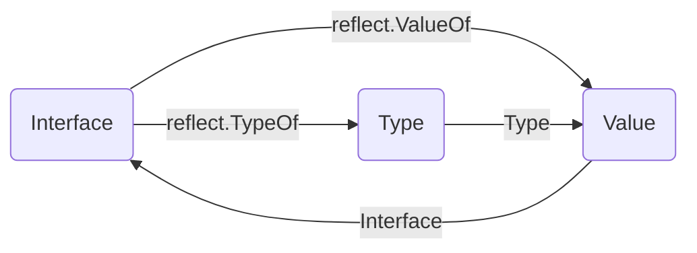

## 定义

反射是指计算机程序在运行时（Runtime）可以访问、检测和修改它本身状态或行为的一种能力。用比喻来说，反射就是程序在运行的时候能够“观察”并且修改自己的行为。

Go 语言提供了一种机制在运行时更新变量和检查它们的值、调用它们的方法，但是在编译时并不知道这些变量的具体类型，这称为反射机制。

当向接口变量赋予一个实体类型的时候，接口会存储实体的类型信息，反射就是通过接口的类型信息实现的，反射建立在类型`interface`的基础上。当我们使用反射特性时，实际上用到的就是存储在 interface 变量中的和类型相关的信息，也就是常说的 `<type,value>` 对。

`emptyInterface` 和 `eface` 类似。

`rtype`与`_type`是一样。reflect所有的类型都会包含 `rtype` 这个字段，表示各种类型的公共信息。


### types 和 interface

- 静态类型

  在编译阶段就确定了的，比如 `int,float64,[]int` 等等，这个类型是声明时候的类型，不是底层数据类型。

- 动态类型

  `iface`包含两个字段：

  ​	`tab` 是接口表指针，指向类型信息；

  ​	`data` 是数据指针，则指向具体的数据。

  它们分别被称为`动态类型`和`动态值`  **`<value,type>`**

  `eface.typ` 就是动态类型


### reflect

- `reflect.Type` 类型相关的信息
- `reflect.Value`  提供很多函数来获取存储在接口里的类型信息

Type、Value、Interface 三者间通过函数 TypeOf，ValueOf，Interface 进行相互转换。


### 反射三大定律

1. 反射将接口变量转换成反射对象 Type 和 Value；
2. 反射可以通过反射对象 Value 还原成原先的接口变量；
3. 反射可以用来修改一个变量的值，前提是这个值可以被修改。


## 类型转换

### interface

1. 转换

```
<结果类型> := <目标类型> (<表达式>)
```

```go
var i int = 9

var f float64
f = float64(i)
```

2. 断言

```
 // 安全类型断言
<目标类型的值>，<布尔参数> := <表达式>.( 目标类型 )  

//非安全类型断言
<目标类型的值> := <表达式>.( 目标类型 )
```

```go
type Student struct {
    Name string
    Age int
}

var i interface{} = new(Student)
s := i.(*Student)
```


### reflect




1. 已有类型转换

```
realValue := value.Interface().(已知的类型)
```

```go
	var num float64 = 1.2345

	pointer := reflect.ValueOf(&num)
	value := reflect.ValueOf(num)

	// 强制转换，如果转换的类型不完全符合，则直接panic
	convertPointer := pointer.Interface().(*float64)
	convertValue := value.Interface().(float64)

```

2. 未知类型转换（遍历探寻其field）

```go
type User struct {
	Id   int
	Name string
	Age  int
}

func main() {
	user := User{1, "name", 25}

	getType := reflect.TypeOf(user)
    getValue := reflect.ValueOf(user)
    
    for i := 0; i < getType.NumField(); i++ {
		field := getType.Field(i)
		value := getValue.Field(i).Interface()
        method := getType.Method(i)
	}

}
```

3. 结构体类型转换

不论类型签名是否相同，只要底层存储方式相同，我们就可以强制转换，并且可以突破私有成员变量限制

```go
type Test1 struct {
	Test1 string
}

type Test2 struct {
	test2 string
}

func TestStruct(t *testing.T) {
	t1 := Test1{Test1: "hello"}
	t2 := *(*Test2)(unsafe.Pointer(&t1))
}

```


## 性能

1. reflect 慢的原因：
   1. 涉及到内存分配以及后续的GC
   2. reflect实现里面有大量的枚举，也就是for循环，比如类型之类的

2. 性能优化

   ```go
   
   var (
   	offset1 uintptr
   	offset2 uintptr
   	offset3 uintptr
   	p       Person
   	t       = reflect.TypeOf(p)
   	pool    sync.Pool
   )
   
   type Person struct {
   	Name   string
   	Age    int
   	Height int
   	Weight int
   }
   
   type emptyInterface struct {
   	typ  *struct{}
   	word unsafe.Pointer
   }
   
   func init() {
   	offset1 = t.Field(1).Offset
   	offset2 = t.Field(2).Offset
   	offset3 = t.Field(3).Offset
   }
   
   func Benchmark_NewQuickReflectWithPool(b *testing.B) {
   	pool.New = func() interface{} {
   		return reflect.New(t)
   	}
   	for i := 0; i < 100; i++ {
   		pool.Put(reflect.New(t).Elem())
   	}
   
   	b.ReportAllocs()
   	b.ResetTimer()
   
   	for i := 0; i < b.N; i++ {
   		p := pool.Get()
   
   		ptr0 := uintptr((*emptyInterface)(unsafe.Pointer(&p)).word)
   		ptr1 := ptr0 + offset1
   		ptr2 := ptr0 + offset2
   		ptr3 := ptr0 + offset3
   
   		*((*string)(unsafe.Pointer(ptr0))) = "Ross"
   		*((*int)(unsafe.Pointer(ptr1))) = 18
   		*((*int)(unsafe.Pointer(ptr2))) = 180
   		*((*int)(unsafe.Pointer(ptr3))) = 108
   
   		// 拿到这个对象几乎就立即放回了对象池，模拟的是对象池资源充足情况下的性能
   		pool.Put(p)
   	}
   }
   ```

   