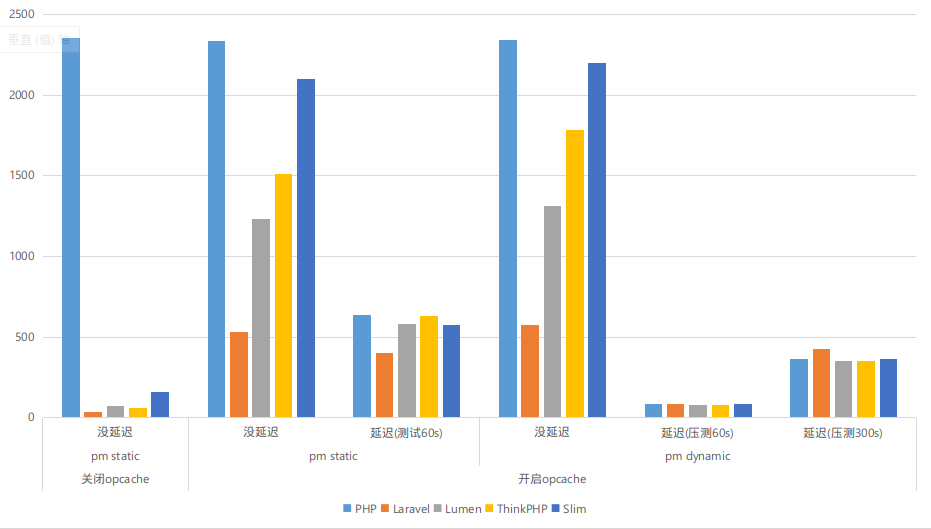

# 性能测试

服务器配置(aliyun)，其他参考 [php install](./install.md) 和 [nginx install](../nginx/install.md)

- `centos 8`
- 4核8G内存
- nginx/1.17.10
- php/8.0.0
  - pm = dynamic/static
  - pm.max_children = 1600
  - pm.start_servers = 4
  - pm.min_spare_servers = 4
  - pm.max_spare_servers = 8 
- 挂载nfs当做代码盘
  - mount -t nfs -o vers=3,proto=tcp,noresvport xxxx.cn-hangzhou.extreme.nas.aliyuncs.com:/ /data
- 页面显示phpinfo 或 SQL连接

> nfs与local比较
>
> nginx的性能大概有10倍的下降，local qps **136694**，nfs qps **12600**
>
> 对PHP影响不大，估计是php的性能还跟不上nginx的压测极限，以下数据全部基于nfs目录测试

测试命令 `wrk -t4 -c1000 -d60s --latency http://172.16.81.180`


## php

显示`phpinfo`页面

#### 开启opcache

##### 没延迟

```
load average: 42.35, 14.06, 7.83

Running 1m test @ http://172.16.81.180/test.php
  4 threads and 1000 connections
  Thread Stats   Avg      Stdev     Max   +/- Stdev
    Latency   409.58ms  457.43ms   2.00s    83.60%
    Req/Sec   587.71    154.07     1.60k    76.51%
  Latency Distribution
     50%  233.39ms
     75%  657.24ms
     90%    1.08s 
     99%    1.76s 
  140402 requests in 1.00m, 10.39GB read
  Socket errors: connect 0, read 0, write 0, timeout 5084
Requests/sec:   2336.48
Transfer/sec:    177.09MB
```

##### 延迟100ms-3s

```
load average: 4.54, 8.43, 5.45

Running 1m test @ http://172.16.81.180/test.php
  4 threads and 1000 connections
  Thread Stats   Avg      Stdev     Max   +/- Stdev
    Latency     1.00s   547.46ms   1.97s    58.02%
    Req/Sec   159.63     39.91   320.00     70.03%
  Latency Distribution
     50%    1.00s 
     75%    1.50s 
     90%    1.80s 
     99%    1.90s 
  38155 requests in 1.00m, 2.82GB read
  Socket errors: connect 0, read 0, write 0, timeout 13820
Requests/sec:    634.98
Transfer/sec:     48.01MB
```


#### 关闭opcache

```
load average: 180.08, 65.20, 28.11

Running 1m test @ http://172.16.81.180/test.php
  4 threads and 1000 connections
  Thread Stats   Avg      Stdev     Max   +/- Stdev
    Latency   439.36ms  279.64ms   2.00s    72.47%
    Req/Sec   595.71    352.64     2.06k    68.95%
  Latency Distribution
     50%  413.76ms
     75%  576.76ms
     90%  772.50ms
     99%    1.40s 
  141445 requests in 1.00m, 10.32GB read
  Socket errors: connect 0, read 0, write 0, timeout 103
Requests/sec:   2353.83
Transfer/sec:    175.88MB
```


## laravel

```shell
composer install --optimize-autoloader --no-dev
php artisan config:cache
php artisan route:cache
php artisan view:cache
```

`session`和`cache`用**redis**


### 开启opcache

```
load average: 82.01, 35.23, 19.82

Running 1m test @ http://172.16.81.180
  4 threads and 1000 connections
  Thread Stats   Avg      Stdev     Max   +/- Stdev
    Latency   499.28ms  361.15ms   1.96s    88.87%
    Req/Sec   146.49     96.55   585.00     70.74%
  Latency Distribution
     50%  396.86ms
     75%  468.43ms
     90%    1.29s 
     99%    1.70s 
  34514 requests in 1.00m, 44.05MB read
  Socket errors: connect 0, read 0, write 0, timeout 709
  Non-2xx or 3xx responses: 225
Requests/sec:    574.42
Transfer/sec:    750.71KB
```


### 关闭opcache

```
load average: 99.68, 27.17, 15.69

Running 1m test @ http://172.16.81.180
  4 threads and 1000 connections
  Thread Stats   Avg      Stdev     Max   +/- Stdev
    Latency     1.07s   521.73ms   1.88s    60.47%
    Req/Sec    18.05     45.09     1.14k    98.59%
  Latency Distribution
     50%    1.07s 
     75%    1.53s 
     90%    1.79s 
     99%    1.88s 
  2180 requests in 1.00m, 2.39MB read
  Socket errors: connect 0, read 0, write 0, timeout 2137
  Non-2xx or 3xx responses: 412
Requests/sec:     36.28
Transfer/sec:     40.75KB
```


# 总结


1. php单个请求执行的时间越长，php-fpm进程数量就会越多，`load average`整体不高（请求平均执行时间100ms-3s，`load average` 在**3**上下，`php-fpm`会启动**1000**左右）
2. opcache能降低内存使用，关闭opcache 每个`php-fpm`内存占用`10M`左右，开启能降低一半


|          | 关闭opcache | 开启opcache/home/ross/Desktop/php perf.png |               |            |               |                |
| -------- | ----------- | ------------------------------------------ | ------------- | ---------- | ------------- | -------------- |
|          | pm static   | pm static                                  |               | pm dynamic |               |                |
|          | 没延迟      | 没延迟                                     | 延迟(测试60s) | 没延迟     | 延迟(压测60s) | 延迟(压测300s) |
| PHP      | 2353.83     | 2336.47                                    | 634.98        | 2339.79    | 82.43         | 361.69         |
| Laravel  | 36.28       | 531.52                                     | 400.51        | 574.42     | 87.19         | 424.32         |
| Lumen    | 75.09       | 1235.26                                    | 583.9         | 1314.51    | 77.75         | 349.1          |
| ThinkPHP | 59.56       | 1514.15                                    | 628.4         | 1785.67    | 76.69         | 349.28         |
| Slim     | 159.47      | 2099.37                                    | 576.09        | 2197.31    | 84.31         | 362.32         |




